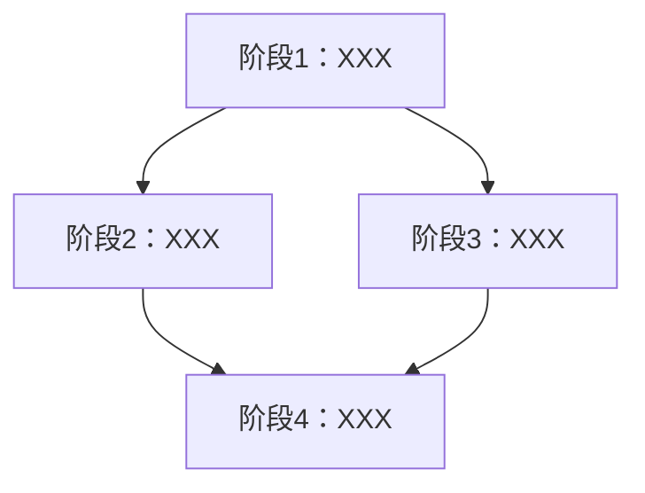

# 项目迁移执行计划

## 基本信息
| 项目 | 内容 |
|------|------|
| **计划日期** | [当前日期] |
| **关联方案** | migration-solution.md |
| **源项目路径** | [source_project] |
| **目标项目路径** | [target_project] |
| **预估总工期** | [X] 个阶段，[X] 人天 |

---

## 1. 阶段划分概览

| 阶段 | 名称 | 预估工时 | 依赖 | 风险等级 |
|:---:|------|:---:|------|:---:|
| 1 | [阶段名称] | [X]人天 | - | 🟢/🟡/🔴 |
| 2 | [阶段名称] | [X]人天 | 阶段1 | 🟢/🟡/🔴 |
| 3 | [阶段名称] | [X]人天 | 阶段2 | 🟢/🟡/🔴 |
| ... | ... | ... | ... | ... |

### 阶段依赖关系

---

## 2. 详细阶段计划

### 阶段 1：[阶段名称]
| 项目 | 内容 |
|------|------|
| **目标** | [本阶段要达成的具体目标] |
| **预估工时** | [X] 人天 |
| **前置条件** | [开始前必须具备的条件] |

**涉及范围**：
| 文件/模块 | 迁移类型 | 预计工时 |
|-----------|:---:|:---:|
| [文件A] | 🟢/🟡/🔴 | [X]h |

**执行步骤**：
1. [步骤1：具体操作]
2. [步骤2：具体操作]

**产出物**：
- [产出物1]
- [产出物2]

**验证标准**：
- [ ] [验证项1]
- [ ] [验证项2]

**风险与应对**：
| 风险 | 概率 | 应对措施 |
|------|:---:|---------|
| [风险] | 高/中/低 | [措施] |

**回滚方案**：[如何回滚本阶段]

---

[每个阶段重复以上结构]

---

## 3. 里程碑节点

| 里程碑 | 对应阶段 | 达成标准 | 预计日期 |
|--------|:---:|------|:---:|
| M1 | 阶段1完成 | [标准] | [日期] |
| M2 | 阶段3完成 | [标准] | [日期] |
| M3 | 全部完成 | [标准] | [日期] |

---

## 4. 资源需求

| 资源类型 | 需求 | 说明 |
|---------|------|------|
| 开发人员 | [N]人 | [技能要求] |
| 测试人员 | [N]人 | [技能要求] |
| 环境 | [需求] | [说明] |
| 工具 | [需求] | [说明] |

---

## 5. 回滚预案

### 整体回滚条件
- [触发整体回滚的条件]

### 整体回滚步骤
1. [步骤1]
2. [步骤2]

---

## 6. 下一步
请确认本计划。确认后请告诉我"开始执行阶段 1"，我将开始迁移第一个阶段。
